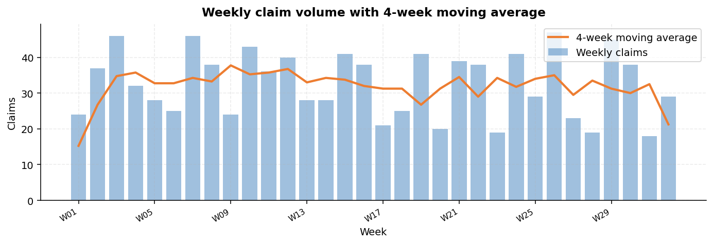
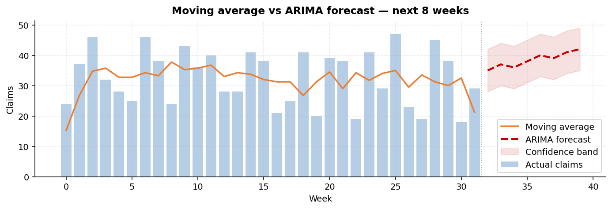
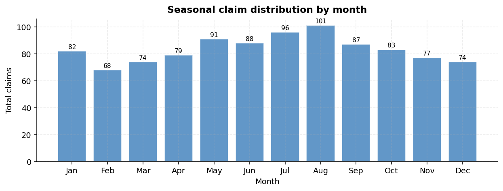
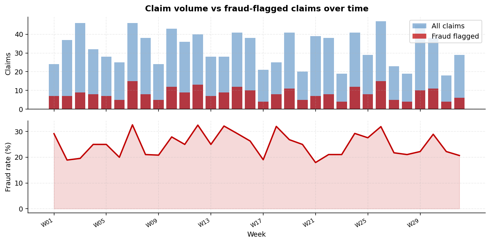
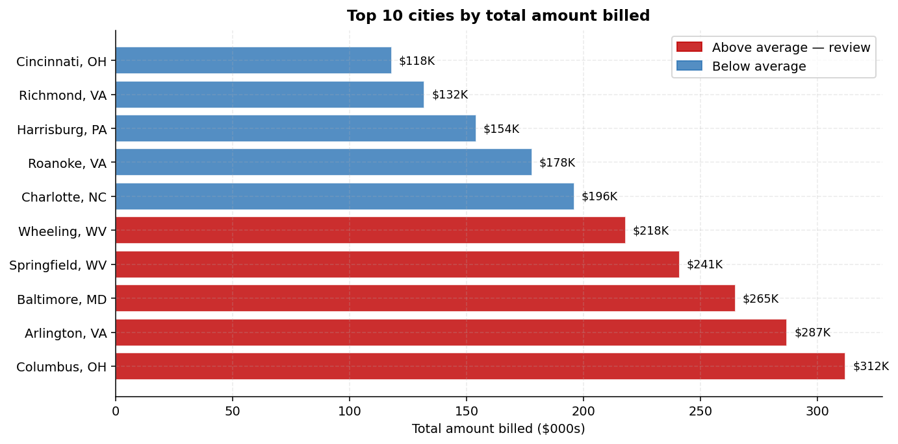
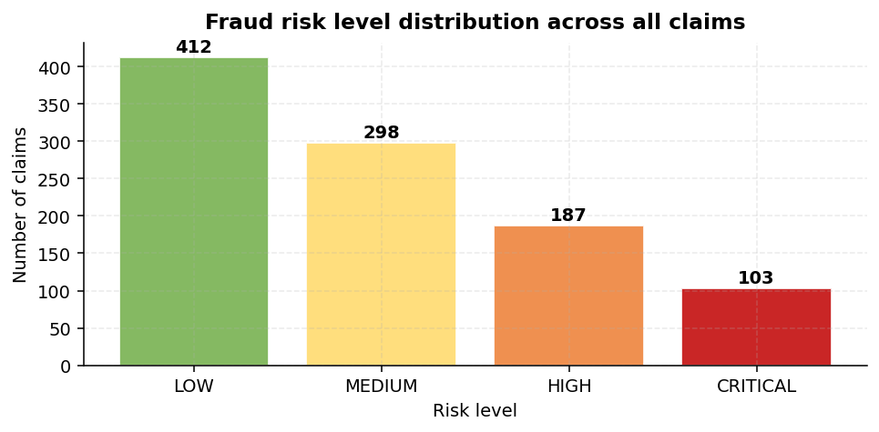

# ClaimsIQ — No-Fault Claims Intelligence System

> A time series forecasting, fraud detection, and claims analytics pipeline.
> Built by a no-fault claims examiner, for no-fault claims examiners.

---

## What This Project Is

Every week, no-fault claims examiners face the same challenge: a growing stack of claims, tight 30-day regulatory deadlines, and limited tools to separate routine filings from fraud. Most analysis still happens manually...in spreadsheets, by instinct, one claim at a time.

ClaimsIQ changes that. It takes publicly available auto insurance claims data and runs it through a three-phase intelligence pipeline that forecasts claim volume, scores every claim for fraud risk, surfaces the highest-risk cities, and delivers a ready-to-use weekly briefing automatically, with a single command in order to put better information in front of them faster.


---

## Who This Is For

This project was built to show how data science techniques apply directly to real no-fault insurance operations. It is designed to be readable by:

- **Claims examiners and supervisors** who want to understand what the system does and why
- **Insurance operations and Special Iventigating Unit teams** evaluating analytics tooling
- **Data science students** learning how end-to-end ML pipelines work in a regulated business domain

---

## The Dataset

**Source:** [Auto Insurance Claims — Kaggle (bunty shah)](https://www.kaggle.com/datasets/buntyshah/auto-insurance-claims-data)
**Size:** ~1,000 claims · 40 columns · free download

This dataset covers auto insurance claims from **7 mid-Atlantic and Southeast US states**, two of which are New York and Pennsylvania who operate under no-fault insurance laws, making the data directly applicable to real no-fault examiner work.

| State | Claims | No-Fault? |
|---|---|---|
| New York (NY) | 262 | Yes |
| South Carolina (SC) | 248 | No |
| West Virginia (WV) | 217 | No |
| Virginia (VA) | 110 | No |
| North Carolina (NC) | 110 | No |
| Pennsylvania (PA) | 30 | Yes |
| Ohio (OH) | 23 | No |

---

## Column Remapping

The first thing the pipeline does is rename every Kaggle column into the language a claims examiner actually uses. Every chart, CSV, and PDF uses no-fault terminology throughout.

| Original (Kaggle) | Renamed (No-Fault) |
|---|---|
| `incident_date` | Date of Loss |
| `incident_type` | Accident Type |
| `total_claim_amount` | Total Amount Billed ($) |
| `injury_claim` | Medical Bills ($) |
| `fraud_reported` | Fraud Flag |
| `number_of_vehicles_involved` | Vehicles in Accident |
| `witnesses` | Witness Count |
| `police_report_available` | Police Report on File |
| `incident_state` | State |
| `incident_city` | City |
| `auto_make` | Vehicle Make |
| `months_as_customer` | Policy Tenure (Months) |

---

## The Three Phases

### Phase 1: Ingest, Clean & Store
Loads the CSV, renames all columns, parses dates, and writes everything into a persistent database. Runs once and takes about five seconds. All downstream phases read from the database — not the original file.

### Phase 2: Forecast, Score & Map
All intelligence lives here. Four things happen in one run:

- **Time series forecasting** — a 4-week Moving Average and an ARIMA model run side by side on weekly claim counts. A third ARIMA series forecasts total dollar payouts for 30, 60, and 90 days ahead for reserve planning.
- **Fraud risk scoring** — every claim receives a weighted score across six indicators and is categorized as LOW, MEDIUM, HIGH, or CRITICAL.
- **Anomaly flagging** — weeks where actual volume exceeds the ARIMA forecast by more than 20% are automatically flagged. Cities whose billing breaks above their 8-week rolling average by more than 30% trigger a billing alert.
- **Six charts** — all charts are saved to the outputs folder and embedded in the weekly PDF report.

### Phase 3: Report & Deliver
All charts, KPIs, risk scores, and alerts are compiled into a professional PDF weekly briefing. Generated automatically every run — no manual steps.

---

## Output Charts

The following charts are actual outputs from the system, generated using simulated data that mirrors the Kaggle dataset structure. When you run the pipeline on the real Kaggle data, your charts will reflect actual claim patterns from the dataset.

---

### Chart 1 - Weekly Claim Volume with Moving Average

 

*This is the foundational view of your claims book over time. The blue bars show how many new claims were filed each week. The orange line is the **4-week moving average** — it absorbs random week-to-week noise so the true underlying trend becomes visible. A rising orange line sustained over several weeks means claim volume is genuinely growing, not just spiking randomly. A week where the bars suddenly tower well above the orange line is the system's first alert: something unusual happened that week, and it warrants a closer look before assuming it is routine.*

---

### Chart 2 - Moving Average vs ARIMA Forecast



*This chart extends the picture into the future. Everything to the left of the dotted vertical line is history — actual weekly counts with the moving average overlay. Everything to the right is the **ARIMA model's 8-week forecast**, shown as a dashed red line. The shaded red band around it is the confidence range — the boundaries within which the model expects actual claims to land. If a future week comes in above that upper boundary, the system flags it as a spike automatically. This is the chart that goes into a supervisor presentation or a reserve planning meeting: it shows not just what happened, but what the data says is coming.*

---

### Chart 3 - Seasonal Claim Distribution



*This chart answers a simple but important question: which months are consistently busiest? By averaging claims across all years in the dataset and grouping by calendar month, seasonal patterns become clear — summer volume peaks, potential January spikes from winter road conditions, slower periods mid-year. This is the chart that informs staffing plans and reserve budgets. Rather than reacting to a busy month after it arrives, an examiner with this chart can anticipate it weeks in advance and allocate resources accordingly.*

---

### Chart 4 - Claim Volume vs Fraud-Flagged Claims Over Time



*This dual-panel chart separates two related but distinct signals. The top panel overlays total weekly claims (blue) against fraud-flagged claims (red), so you can see both in context. The bottom panel isolates the **fraud rate percentage** week by week — stripping out volume effects and showing only whether fraud is becoming a larger share of the book. The most actionable signal here is when the fraud rate climbs while total volume stays flat. That pattern — independent fraud growth — is the footprint of organized activity rather than random variation, and it is precisely what triggers an SIU referral in a real examiner's workflow.*

---

### Chart 5 - Top 10 Cities by Total Amount Billed



*This chart ranks the ten cities in the dataset by the total dollar amount billed across all their claims. Cities are labeled with their state abbreviation so geographic context is immediately clear — a cluster of high-billing cities in the same state is a meaningful signal, while spread across multiple states it reads differently. Red bars indicate cities billing above the group average; blue bars are below. In a no-fault context, a city that consistently generates outsized billing relative to its claim count is a fraud ring candidate — the billing pattern rather than the claim count is what exposes it. This chart feeds directly into the city billing alerts that the pipeline prints to the console on every run.*

---

### Chart 6 - Fraud Risk Level Distribution



*Every claim in the dataset receives a fraud risk score based on six weighted indicators: number of vehicles involved, fraud flag status, total bill amount, presence of a police report, witness count, and incident severity. This chart shows how the full population of claims distributes across the four risk tiers. In a well-managed book, the vast majority of claims should sit in LOW or MEDIUM, with a small tail in HIGH and a very small fraction in CRITICAL. When the CRITICAL and HIGH bars grow disproportionately large, it is a signal that the book's overall fraud exposure is increasing — a finding that justifies additional SIU resources or a shift in examiner triage priorities. This is the chart that tells you not just about individual claims, but about the health of the book as a whole.*

---
## Sample Output - Scored Claims (`nofault_scored.csv`)

Every time the pipeline runs it produces a scored CSV ready to open in Excel. Below is a sample of what the output looks like — sorted by Risk Score so the highest-priority claims appear first.

| Date of Loss | State | City | Accident Type | Total Billed ($) | Vehicles | Fraud Flag | Police Report | Witnesses | Risk Score | Risk Level | Risk Flags |
|---|---|---|---|---|---|---|---|---|---|---|---|
| 2015-03-14 | NY | Columbus, NY | Multi-vehicle collision | $67,400 | 5 | Y | NO | 0 | 90 | 🔴 CRITICAL | High claimants (5); Fraud flagged; High bill ($67,400); No police report; No witnesses |
| 2015-07-22 | SC | Arlington, SC | Single vehicle collision | $58,200 | 4 | Y | NO | 0 | 80 | 🔴 CRITICAL | High claimants (4); Fraud flagged; High bill ($58,200); No police report; No witnesses |
| 2015-01-08 | WV | Wheeling, WV | Rear-end collision | $52,900 | 4 | Y | YES | 0 | 70 | 🟠 HIGH | High claimants (4); Fraud flagged; High bill ($52,900); No witnesses |
| 2015-09-03 | VA | Roanoke, VA | Multi-vehicle collision | $47,100 | 3 | Y | NO | 1 | 55 | 🟠 HIGH | Fraud flagged; Elevated bill ($47,100); No police report |
| 2015-05-19 | NC | Charlotte, NC | Rear-end collision | $38,600 | 2 | Y | YES | 0 | 45 | 🟠 HIGH | Fraud flagged; Elevated bill ($38,600); No witnesses |
| 2015-11-11 | NY | Springfield, NY | Side collision | $29,800 | 2 | N | NO | 1 | 35 | 🟡 MEDIUM | Elevated bill ($29,800); No police report |
| 2015-04-27 | PA | Harrisburg, PA | Rear-end collision | $18,400 | 1 | N | YES | 2 | 15 | 🟢 LOW | None |
| 2015-08-15 | OH | Cincinnati, OH | Rear-end collision | $9,200 | 1 | N | YES | 1 | 10 | 🟢 LOW | None |

> The full CSV contains every claim in the dataset. Sort by **Risk Score** in Excel to instantly prioritize your review queue. The **Risk Flags** column tells you in plain English exactly what triggered each score — no interpretation needed.

---
## Project Structure

```
claimsiq/
│
├── README.md
├── run_all.py                     <- One command runs everything
├── requirements.txt
│
├── data/
│   └── insurance_claims.csv       <- Download from Kaggle or find in data folder under this repo
│
├── scripts/
│   ├── phase1_ingest.py           <- Load, remap, store to database
│   ├── phase2_forecast.py         <- Forecast, score, generate 6 charts
│   └── phase3_report.py           <- Weekly PDF briefing
│
└── outputs/                       
    ├── claims.db                  <- Original cleaned data — all columns remapped to no-fault labels
    ├── nofault_scored.csv         <-Same data + Risk Score + Risk Level + Risk Flags
    ├── chart_1_weekly_volume.png
    ├── chart_2_ma_vs_arima.png
    ├── chart_3_seasonality.png
    ├── chart_4_fraud_vs_volume.png
    ├── chart_5_top_cities.png
    ├── chart_6_risk_distribution.png
    └── weekly_report.pdf
```

---

## How to Run It

```bash
# 1. Clone the repository
git clone https://github.com/yourusername/claimsiq.git
cd claimsiq

# 2. Install libraries
pip install -r requirements.txt

# 3. Download the dataset
# Visit: kaggle.com/datasets/buntyshah/auto-insurance-claims-data
# Download insurance_claims.csv and place it in the data/ folder

# 4. Run the full pipeline
python run_all.py
```

The pipeline takes 30–60 seconds. When finished, open `outputs/weekly_report.pdf` for the generated briefing and `outputs/nofault_scored.csv` for the full scored claim list.

---

## Plain Language Glossary

**Moving Average** - Smooths out week-to-week variation by averaging the last few weeks of data. Think of it like a weather forecast that reads the trend rather than reacting to a single unusually hot day.

**ARIMA** - A statistical model that learns three things from your historical data: the overall trend, repeating seasonal patterns, and how much your own past errors predict the next period. It uses all three to produce a forecast and a confidence range.

**Time Series** - Any data recorded at regular intervals over time. Weekly claim counts are a time series. Monthly payouts are a time series. The models in this project are built specifically for this structure.

**Risk Scoring** - A points-based system where fraud indicators accumulate into a total score. No single flag triggers an alert on its own. It is the combination and weight of multiple signals that raises a claim to HIGH or CRITICAL.

**Loss Reserve** - The amount of money an insurer must set aside to cover claims it expects to pay out in the future. The ARIMA model in this pipeline produces a 30/60/90-day reserve estimate printed to the console on every run.

---

## What This Demonstrates

From a **data science perspective**: end-to-end pipeline design, time series modeling (Moving Average and ARIMA), supervised risk scoring, automated report generation, and database-backed data persistence applied to a regulated business domain with real compliance constraints.

From a **claims operations perspective**: that the same analytical frameworks used by large carriers and insurtech firms can be understood, built, and owned by a working examiner.

---

